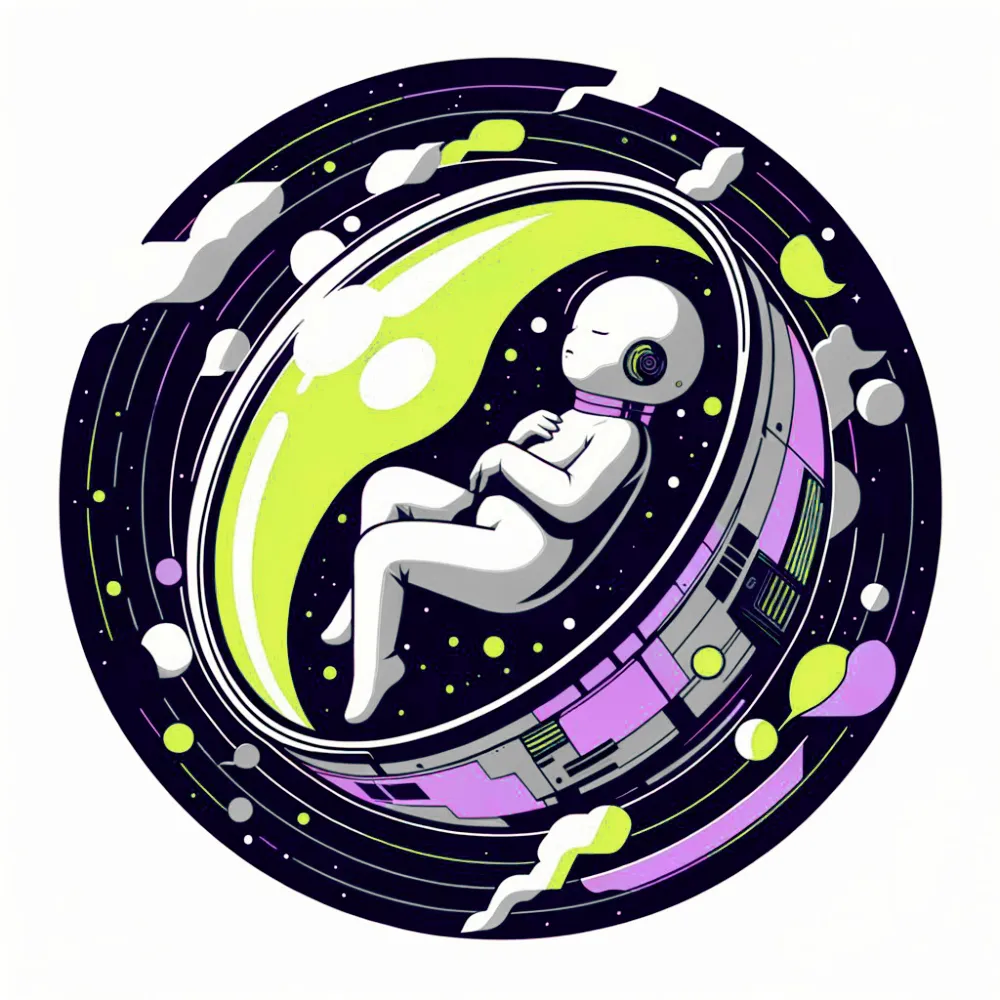

# How to start your digital life?

  

## Create a dedicated identity

`dfx identity new <your-name>`

## Switch to the new identity

`dfx identity use <your-name>`

## Make sure you have cycles for deployment

[ADD EXPLANATION]

## Create a canister in the subnet

> In this step, we are merely setting up a container without deploying any code. To maximize the network's potential, we will all deploy in the same subnet.

`dfx canister create you --subnet bkfrj-6k62g-dycql-7h53p-atvkj-zg4to-gaogh-netha-ptybj-ntsgw-rqe --ic`

## Create the WebAssembly module

In this step, we are compiling the Motoko file to create the WebAssembly module.

`dfx build you --ic`

## Choose your name and install the WebAssembly module

> Please provide your desired username for the Reboot game when you deploy your canister. Currently, you cannot change the username once set, unless you reinstall your canister.

`dfx canister install you --ic --argument '("YOUR_NAME")'`

## Perform your first check

`dfx canister call you --ic reboot_dailyCheck '("Hello World!")`

**Welcome to the Reboot!**
